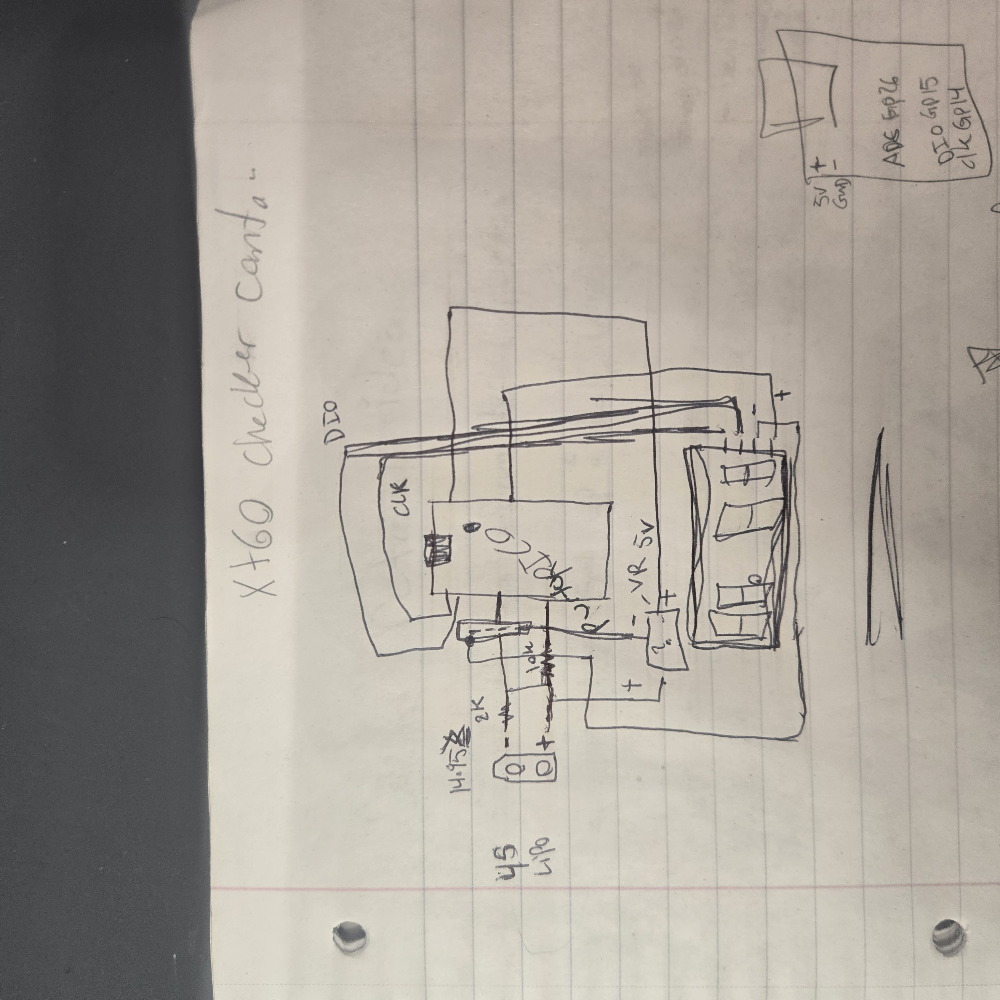
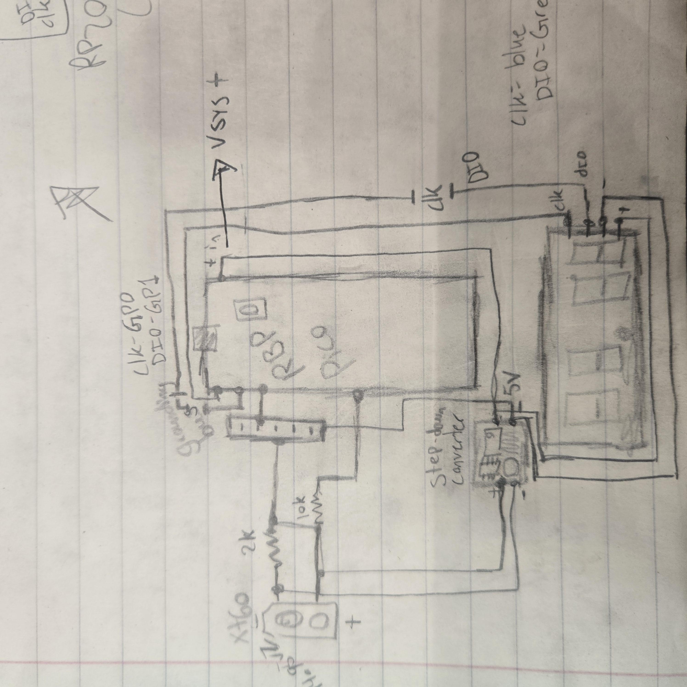

# RP2040 LiPo Battery Checker

### A compact MicroPython battery-voltage checker for FPV drone LiPo batteries

**Status: 🚧 In Development**

I wanted a small and simple way to check the voltage of my FPV drone batteries.

I wasn't particularly happy with the commercial options I found, especially for what they cost, so I decided to use the problem as an opportunity to build my own. The project also gave me a reason to put more of my electronics knowledge into practice and learn MicroPython for the first time.

The goal is a small handheld device that can quickly measure and display battery voltage without needing a larger charger or test equipment.

## Project Goals

- Build a compact handheld LiPo voltage checker
- Measure battery voltage safely using a microcontroller ADC
- Display the measured voltage on an integrated display
- Learn MicroPython through a practical first project
- Design the circuit and wiring rather than relying on a premade module
- Package the finished electronics into a small portable enclosure

## Initial Prototype

The first prototype used a standard Raspberry Pi Pico.

I began by designing the basic circuit and experimenting with it on a breadboard while learning how to read analog voltage using MicroPython.

One of the first problems I encountered was also a fairly effective lesson in microcontroller voltage limits.

During early prototyping I accidentally exposed circuitry on two Raspberry Pi Picos to voltage beyond what the 3.3 V electronics could tolerate, damaging both boards.

That forced me to better understand the distinction between the battery voltage being measured, the voltage presented to the ADC, and the voltage used to power the microcontroller itself.

## Revised Hardware

After the initial prototypes, I moved to a much smaller RP2040-based development board.

The smaller board was actually a better fit for the original goal because it significantly reduced the size of the finished device.

The revised design is intended to move away from the breadboard prototype and toward a cleaner permanent circuit.

Planned/current hardware includes:

- RP2040-based microcontroller
- Voltage-divider measurement circuit
- Integrated voltage display
- LED indicator
- Voltage regulator
- LiPo battery input
- Custom wiring/circuit layout

  ## Design Evolution

The battery checker began as a hand-drawn concept while I worked through how the battery input, voltage measurement circuit, microcontroller, display, and power supply would interact.

### Initial Concept

The first drawing was primarily used to work through the overall layout and connections between the major components. At this stage I was still determining how the RP2040 would measure the battery voltage while remaining safely isolated from voltages above its ADC limits.

### First Prototype Design

After working through the initial concept, I created a more detailed version showing the voltage-divider circuit, step-down converter, RP2040, display wiring, and GPIO connections.

This design became the basis for the first physical prototypes.

Testing those prototypes exposed several problems, including mistakes in how I handled voltage limits that resulted in damaged microcontrollers. Those failures changed how I approached the project and reinforced the importance of checking power rails, component limits, and circuit behavior before connecting sensitive hardware.

### Current Revision

The project is now being revised around a smaller RP2040-based board to reduce the overall size and improve the design.

The next revision will also incorporate improvements discovered during prototyping, including cleaner power regulation, indicator hardware, and a more permanent circuit layout.

The original drawings are preserved here to document how the design developed rather than replacing them with only the final version.

## Voltage Measurement

Because the voltage of the battery can exceed the safe input voltage of the RP2040's ADC, the battery cannot be connected directly to the analog input.

A resistor voltage divider is used to reduce the measured battery voltage to a safe range for the ADC.

The microcontroller can then measure that reduced voltage and use the known divider ratio to calculate the original battery voltage in software.

This was one of the most useful concepts I learned during the project because it connected the electronics side of the circuit directly with the MicroPython code interpreting the measurement.

## Software

This is my first MicroPython project.

The software is responsible for:

- Reading the RP2040 ADC
- Converting the ADC reading into a voltage
- Accounting for the resistor-divider ratio
- Displaying the calculated battery voltage
- Controlling status/indicator hardware

The MicroPython source code will be included in this repository as the project develops.

## Problems & Lessons Learned

### Voltage Limits

The most expensive early lesson was learning to verify the voltage limits of every part of a circuit before connecting the microcontroller.

Two Raspberry Pi Picos were damaged during early prototyping after being exposed to inappropriate voltage levels.

Rather than hiding those failures, they became part of how I changed my approach to electronics projects: verify power rails, understand component limits, and document the circuit before connecting expensive or sensitive components.

### Breadboard to Permanent Hardware

Getting a circuit working on a breadboard is only the first step.

The current phase of the project involves translating the prototype into a smaller, cleaner, and more permanent device while incorporating voltage regulation and additional indicator hardware.

## Current Status

The project is currently being redesigned around the smaller RP2040 board.

The next steps are:

- Finalize the revised schematic
- Verify the power and measurement circuits before connecting the RP2040
- Assemble the permanent version
- Complete and clean up the MicroPython code
- Calibrate voltage measurements against a trusted meter
- Design the final enclosure
- Test the device across the intended LiPo voltage range

## Tools & Technologies

- RP2040
- MicroPython
- Analog-to-Digital Conversion (ADC)
- Voltage-divider circuits
- Voltage regulation
- Breadboard prototyping
- Soldering
- Electronics troubleshooting
- Circuit/schematic design
